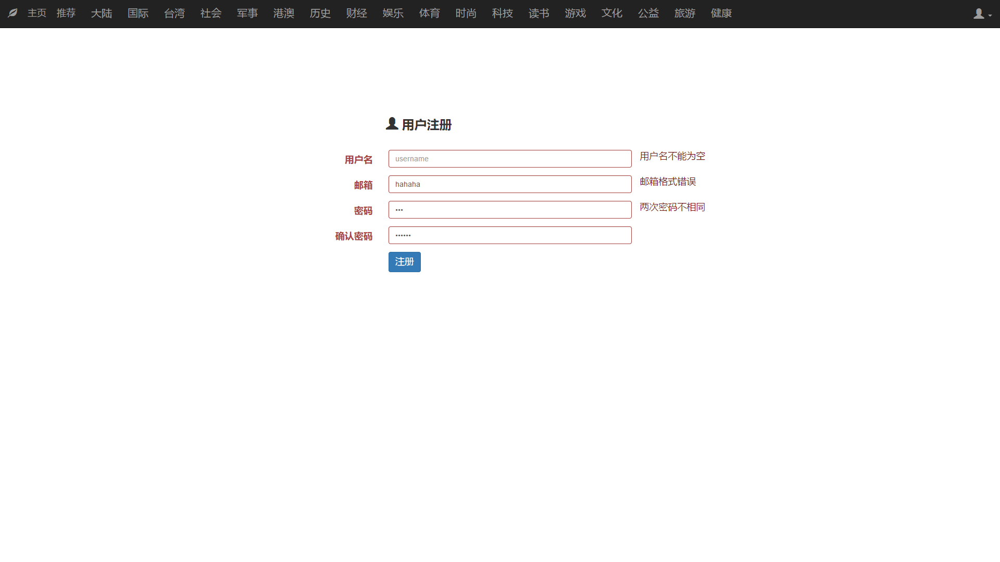
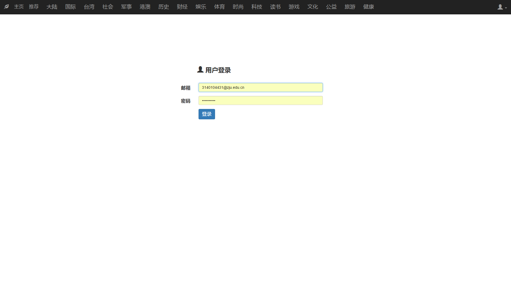
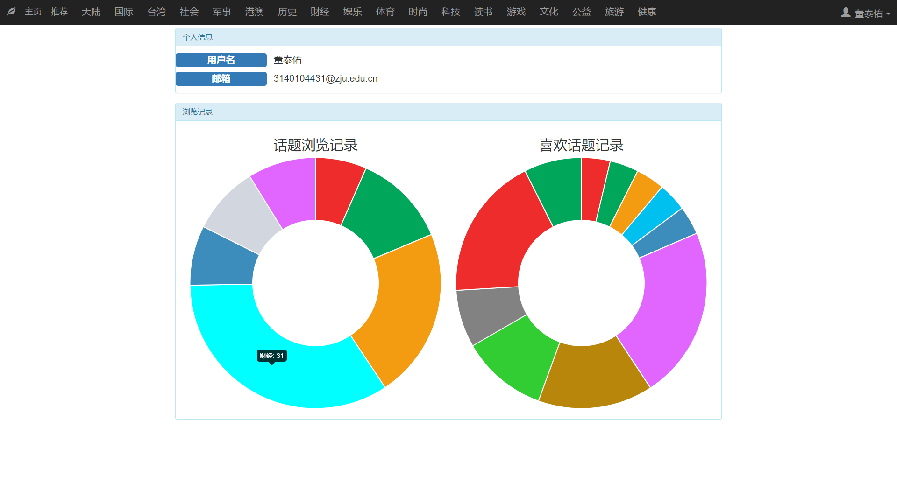

# 一、项目要求
1. 定时到各主流新闻门户网站抓取信息 
2. 用户访问网站时能看到聚合的信息内容 
3. 实现用户注册、登录功能，用户注册时需要填写必要的信息并验证，如用户名、密码要求在6字节以上，email 的格式验证，并保证用户名和 email 在系统中唯一。
4. 用户登录后可以设置感兴趣的新闻资讯栏目，用户访问网站的展示页面会根据用户设置做出相应的调整 
5. 实现一个 Android 或 iphone 客户端软件，功能同网站，但展示界面根据屏幕大小做 UI 的自适应调整，并能实现热点新闻推送 
6. 具体一定的学习能力，能根据用户的使用习惯调整展现的内容

# 二、项目架构及运行

## 1. 项目架构

* __前端框架__ : bootstrap
* __服务器框架__ : node.js koa2
* __数据库__ : mongodb 

## 2. 运行

首先安装node.js和mongodb

### 网页端

进入NewsAggregationWebsiteKoa2工程目录，在cmd运行`npm install`命令安装项目运行需要的模块。

在运行项目之前需要先运行新闻的爬取项目将新闻爬取到数据库中，新闻爬去的项目在：<https://github.com/TaiyouDong/NewsSpider>

每次运行服务器需要在NewsAggregationWebsiteKoa2目录下运行`npm start`命令打开服务器

随后在浏览器加载页面：localhost:3000/ 即可访问相应网站

### android端

android工程在NewsAggregrationApp下。
由于网页端设置为了响应式，并且支持移动端设备，所以APP直接调用了一个webview显该网页

在运行前需要修改MainActivity.java中的打开网页的ip地址的路径，设置为相应的ip地址即可

# 三、功能划分

## 1. 新闻爬取模块

新闻爬取模块由python实现。首先从各个新闻网站抓取新闻，并在抓取的过程中实现了对新闻的分类，例如：国际，军事，财经，文化，公益等。不同类别的新闻储存在数据库不同的类别中。

在爬取新闻内容时会爬取新闻的标题，新闻发布的时间，以及记录下新闻原网站的网址。新闻的内容会分为三类：p代表不同段落，strong代表加粗的字体和段落，img代表图片。如果是图片，则保存下该图片的链接。

## 2. 新闻列表加载模块

通过向服务器发送相应新闻的类别，从服务器获取到该新闻类别下所有新闻的列表。然后将该新闻类别下所有新闻的预览通过js动态加载到网页中。并在加载的过程中实现了分页的功能。

用户可以在新闻列表中选中或者取消喜欢的新闻，选中或者取消选中喜欢的新闻通过向服务器发送添加或删除喜欢新闻的请求实现。

## 3. 新闻内容加载模块

通过向服务器发送该新闻的id，从服务器获取该新闻的详细内容及信息，并加载到网页端。

用户在进入该网页时，会向服务器发送增加用户浏览记录的请求。服务器收到请求后会在用户相应的浏览记录中增加该新闻的记录。

用户同样可以在该页面选中或者取消选中喜欢的新闻。

## 4. 用户管理模块

用户可以通过注册模块向系统中注册，需要输入用户名，邮箱和密码，邮箱是唯一属性，用户注册时会检测该邮箱用户是否已经存在。邮箱需要是正确的邮箱的格式，密码需要保证两次密码输入完全相同。

用户登录输入邮箱和密码即可，向服务器发送请求后，服务器端会检测用户邮箱是否存在、邮箱和密码是否匹配等。

访问新闻页面时会检测此时用户是否登录，如果用户已经登录，则会记录用户的浏览新闻记录和同步用户关注或取消关注新闻的操作，统计出的数据用户用户新闻的个性推荐的分析。

## 5. 服务器路由模块

node.js下的routes根据前端请求的路径对请求进行分类，然后调用不同的模块对不同的请求进行处理，进而返回不同的数据。

## 6. 数据库交互模块 

通过不同的接口直接与数据库进行交互并返回结果。与mongodb的交互通过mongoose模块实现。

## 7. 新闻推荐模块

新闻推荐模块通过分析用户浏览新闻和关注新闻话题的个数得到用户比较喜爱的新闻的话题。在这些话题中的每个话题中提取一定数量的新闻（不包含用户浏览过的和关注过的新闻），得到新闻列表后返回给前端页面。

每次得到的新闻列表都会根据用户的浏览记录和关注新闻的记录动态生成。

## 8. Android客户端模块

由于前端在实现界面时实现了响应式的页面，故在android客户端只需调用一个webView将相应的网址加载出来即可以实现APP同样的功能。

新闻的推送通过APP定时向服务器发送获取推送的请求，服务器向Android客户端返回相应的推送的内容。客户端在获取推送内容后将推送内容推送至Andorid手机的状态栏，提醒用户观看相关新闻。

服务器推送的内容即为推荐新闻栏目的第一条新闻。

# 四、功能模块设计

## 1. 新闻主页

PC端新闻主页：

移动端新闻主页：

在访问新闻主页时首先会读取cookie中的新闻类别，如果读取不到，则默认访问新闻主页（即时新闻），如果读取到了新闻类别，则向服务器发送该新闻类别并获取该新闻类别下的新闻列表并显示出来。

在新闻列表中会显示出新闻的标题和部分正文以及图片，PC端设置新闻列表最大图片显示个数为3，在移动端则最多显示一张图片。如果新闻中没有出现图片则不显示图片。

如果想要访问新闻的详细信息，则点击新闻标题的链接或者详细按钮，页面变会跳转至单个新闻页面。

顶层的状态栏会根据PC端或者移动端进行调整，在PC端则会将各个新闻话题的栏目放在顶层状态栏，在移动端则会集成到右上角的按钮中。

在新闻主页中也实现了分页功能：

每页加载新闻的个也会更具PC端和移动端进行调整。

用户点击喜欢按钮可以关注该新闻，同时服务器中该用户的关注新闻列表会添加对应新闻的ID，在次点击则会取消关注，对应的该用户的关注新闻列表会减去该新闻的ID。
用户只有在的登录后可以使用该功能。

## 2. 新闻页面

PC端新闻页面：

移动端新闻页面：

新闻页面会显示出新闻的标题，发布时间，新闻的内容等信息。

在访问新闻页面时，客户端会向服务器发送该新闻的id，服务器通过新闻id得到新闻的详细信息并返回给客户端进行解析。

客户端会根据页面的大小（PC端还是移动端）来设置图片和标题的大小。

点击新闻右上角心型图标可以关注该新闻，再次点击会取消关注，同样会同步更改该用户数据库中的信息。

在页面的末尾会附带新闻原网站的链接，点击原文连接可以跳转至相应网站。

## 3. 用户注册

PC端注册：

移动端新闻注册：

首先点击下拉栏中的注册的选项进入用户注册的页面。

在用户注册时前端会检测用户名是否为空，邮箱格式是否正确，用户两次输入密码是否相同，如果都正确才向后端发送用户注册的请求。

后端在接受到注册请求后则检测用户注册的邮箱是否被占用，如果邮箱已经被占用，则返回false，提醒用户注册失败。否则提示该用户已成功注册。

## 4. 用户登录

PC端用户登录

移动端用户登录：

用户在登录时需要输入邮箱和密码（邮箱是辨识用户的唯一ID）。

同样在登录时会检测邮箱格式。如果用户输入邮箱格式正确且密码不为空，则向服务器发送该用户的邮箱和用户输入的密码。服务器则调用与数据库模块连接的接口读取该用户的信息，如果找不到该邮箱或者用户输入的密码和数据库中的密码不匹配，则放回false，提示用户输入邮箱或者密码错误。否则用户登录成功，页面跳转至home。

## 5. 用户修改信息

PC端信息修改：

移动端信息修改：

用户可以修改除邮箱外的个人信息：用户名和密码等。用户在修改信息时同样要保证两次输入密码相同，用户名不能为空等。

如果用户信息修改成功，则提示用户信息已成功修改。

## 6. 用户个人主页

PC端个人主页：

移动端个人主页：

在登录后可以点击选择个人主页页面，在个人主页会显示出用户的用户名和邮箱以及用户浏览话题的记录和关注（喜欢）话题的记录。

关注和喜欢话题的情况以扇形统计图的形式呈现出来，图表可以直观的反映出用户对某类新闻话题的偏爱。将鼠标移动到相应统计图扇区的上方会显示出统计的信息。

## 7. 新闻个性推荐

PC端推荐页面：

移动端推荐页面：

推荐页面和普通的新闻页面基本一致，不同的是推荐页面获取新闻是获取的是服务器根据用户的浏览和喜欢新闻动态得到的新闻列表。

故推荐页面的新闻不是某一个类别的新闻，而是根据用户的喜欢和关注新闻分析出用户感兴趣的话题后，每个话题提取出前5个用户没有喜欢过和关注过的新闻，集合到新闻列表中返回给前端界面。

每次打开推荐页面都会根据用户此时的浏览和关注记录实时调整推荐的内容。

# 五、代码架构及实现

## 1. 工程代码架构

views目录下是前端的html页面，javastripts目录下是前端页面对应的js文件以及前端界面依赖的库文件。

routes目录下是服务器端处理前端请求的路由。其中database.js是服务器与数据库交互的接口。路由通过调用database.js提供的接口访问和修改数据库，并将得到的数据返回给前端。

